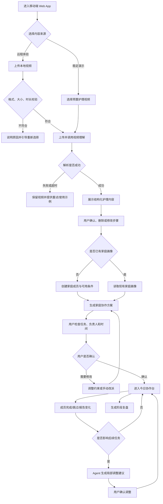
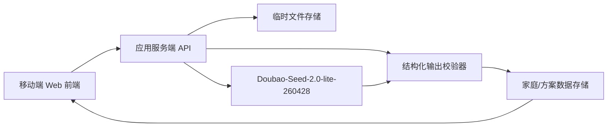

# 新生儿家庭协作台 PRD v1.0

> 项目英文名：Family Collaboration Agent  
> 项目类型：Hackathon MVP  
> 产品形态：移动端优先的响应式 Web App  
> 团队与周期：4 人 / 40 小时  
> 文档日期：2026-07-21  
> 文档状态：待团队评审

---

## 1. 产品概述

### 1.1 一句话定位

新生儿家庭协作台面向 0–6 个月新生儿的多成员照护家庭，将用户认可的护理视频转化为适配家庭成员、时间安排和分工偏好的可执行协作方案。

产品完成的核心转化是：

> Content → Structured Knowledge → Family Action → Adjustment → Review

### 1.2 用户问题

目标家庭并不只是缺少护理知识，更缺少将知识转化为共同执行方案的协调机制：

- 父母收藏大量视频，但无法快速整理成行动步骤。
- 家庭成员接触的信息不同，对同一件事采用不同做法。
- 妈妈承担提醒、解释、协调与检查等隐形劳动。
- 月嫂离开后，经验没有形成可交接的家庭流程。
- 任务依靠口头沟通，责任、时间与完成状态不清晰。

### 1.3 产品目标

MVP 必须证明一件事：AI 能把一条新生儿护理视频稳定地转化为一份家庭看得懂、愿意确认、能够执行的协作方案。

Hackathon 展示目标：

1. 评委可用预置视频在 3 分钟内走完核心闭环。
2. 远程体验者可以上传自己的视频并获得真实 AI 解析结果。
3. 用户可以建立家庭成员画像，并看到任务如何因成员条件而变化。
4. 用户可以调整突发情况，并看到方案被重新编排。
5. 所有医疗高风险内容均有清晰边界，不把产品包装成医疗咨询工具。

### 1.4 成功指标

| 指标 | MVP 目标 | 测量方式 |
|---|---:|---|
| 预置视频主流程完成率 | ≥ 95% | 从选择视频到生成方案的成功次数 / 尝试次数 |
| 预置视频首份方案生成时长 | ≤ 20 秒 | 点击“开始生成”至方案页可编辑 |
| 合规真实视频解析成功率 | ≥ 80% | 满足格式与大小限制的视频中成功返回结构化结果的比例 |
| 核心演示完成时间 | ≤ 3 分钟 | 选择视频、确认内容、生成方案、调整一次任务 |
| 结构化结果有效性 | 必须包含步骤、时间建议、注意事项、来源时间点 | 自动校验字段完整性 |
| 医疗安全提示覆盖率 | 100% | 涉及异常症状、药物、诊断时触发提示 |

### 1.5 产品价值与商业价值

- **用户价值**：减少信息整理和家庭协调成本，让“看过”变成“全家会做”。
- **比赛价值**：展示多模态理解、结构化生成、约束规划和动态调整组成的完整 Agent 闭环。
- **商业价值**：本阶段不以变现为目标；赛后可验证家庭订阅、月嫂交接包或母婴服务机构合作，但不纳入本次 MVP。

### 1.6 非目标与边界

MVP 不做：

- 疾病诊断、用药建议、处方或紧急医疗决策。
- 开放式育儿知识问答平台。
- 通用视频总结器。
- 家庭即时通信、群聊或社区。
- 完整日历系统、复杂消息推送和原生 App。
- 多个对外可见的 Agent。
- AI 未经用户确认直接发布或修改高风险护理任务。

---

## 2. 目标用户与使用场景

### 2.1 核心用户画像

#### 画像 A：主要协调者

- 通常是新手妈妈，也可能是爸爸。
- 收藏了较多护理视频，愿意学习但时间碎片化。
- 了解家庭成员的空闲时间和能力边界。
- 希望减少重复解释、催促和检查。

#### 画像 B：协作照护者

- 包括爸爸、老人或月嫂。
- 时间、经验、体力和操作偏好不同。
- 希望任务指令简短明确，知道“什么时候、做什么、做到什么程度”。
- 不希望学习复杂软件。

### 2.2 典型场景

#### 场景 1：将收藏的视频变成今晚的家庭任务

妈妈上传一条“新生儿睡前护理流程”视频。AI 提取操作步骤和注意事项；家庭画像显示爸爸晚间有空、奶奶不适合弯腰久站。系统据此将洗护准备分配给爸爸，将用品整理分配给奶奶，并保留妈妈最终确认。

#### 场景 2：月嫂离开前完成流程交接

家庭选择预置或自行上传的护理视频，将月嫂当前做法整理成可复用流程。成员逐项确认是否会做，系统把尚未掌握的步骤标记为“需要陪同”或“先学习”。

#### 场景 3：临时变化后重新安排

爸爸临时加班，无法完成晚间任务。主要协调者将爸爸状态改为“今晚不可用”，Agent 只重新安排受影响任务，并说明调整原因，不推翻已完成或已确认的部分。

---

## 3. 核心用户动线



异常原则：

- 上传失败不清空已填写的家庭画像。
- AI 解析失败保留原视频记录，允许重试或切换预置视频。
- 无权限修改时展示原因，不静默失败。
- Agent 的调整必须经过用户确认后才进入执行状态。

---

## 4. 功能清单与优先级

```text
新生儿家庭协作台
├── 🔴 P0 视频输入与理解
│   ├── 选择预置视频
│   ├── 上传真实视频
│   ├── 上传校验与进度
│   ├── 调用 Doubao-Seed-2.0-lite-260428
│   └── 输出可编辑的结构化护理步骤
├── 🔴 P0 家庭画像
│   ├── 新增/编辑家庭成员
│   ├── 设置身份、经验、可用时间与限制
│   └── 设置方案偏好
├── 🔴 P0 协作方案生成与确认
│   ├── 将护理步骤转化为任务
│   ├── 分配负责人、时间与协作者
│   ├── 展示分配理由与注意事项
│   └── 用户确认、改派或重新生成
├── 🔴 P0 今日协作台
│   ├── 按时间展示任务
│   ├── 完成、跳过与查看步骤
│   └── 汇总家庭进度
├── 🔴 P0 动态调整
│   ├── 报告成员不可用或任务延误
│   ├── 识别受影响任务
│   └── 生成并确认局部调整方案
├── 🟡 P1 家庭复盘
│   ├── 完成率与异常汇总
│   └── 下次方案优化建议
├── 🟡 P1 分享体验
│   ├── 临时家庭空间
│   └── 只读方案分享链接
└── ⚪ P2 赛后规划
    ├── 多家庭长期账户
    ├── 通知与日历同步
    ├── 月嫂交接模板库
    └── 微信小程序
```

### 4.1 40 小时强制范围

P0 只要求跑通一条可验证闭环：

> 选择/上传视频 → 结构化解析 → 建立家庭画像 → 生成并确认方案 → 完成任务 → 报告一次变化 → 局部调整

如时间不足，按以下顺序降级：

1. 先取消 P1 家庭复盘。
2. 再取消跨设备实时同步，保留单设备演示。
3. 再将成员独立登录降级为主要协调者代操作。
4. 不得取消真实 AI 视频解析、家庭约束分配和动态调整，这三项构成项目差异化。

---

## 5. 关键页面布局线框

核心页面选择“今日协作台”。这是用户生成方案后最常停留、最能体现家庭分工价值的页面。

```text
┌──────────────────────────────────┐
│ 新生儿家庭协作台      [家庭头像] │
│ 7 月 21 日 · 今天                │
├──────────────────────────────────┤
│ 今日进度                          │
│ ███████░░░  4/6 已完成            │
│ 妈妈 2/2  爸爸 1/2  奶奶 1/2     │
├──────────────────────────────────┤
│ [!] 家庭变化                      │
│ 爸爸今晚临时加班                  │
│ [让 Agent 调整安排]               │
├──────────────────────────────────┤
│ 08:00                             │
│ ┌──────────────────────────────┐ │
│ │ ● 晨间喂养记录               │ │
│ │ 负责人：妈妈 · 预计 10 分钟  │ │
│ │ 来源：视频 01:24             │ │
│ │ [查看步骤]          [完成]   │ │
│ └──────────────────────────────┘ │
│ 20:00                             │
│ ┌──────────────────────────────┐ │
│ │ ○ 睡前用品准备               │ │
│ │ 负责人：爸爸 · 奶奶协助      │ │
│ │ 分配原因：爸爸晚间可用       │ │
│ │ [查看步骤] [改派]    [完成]   │ │
│ └──────────────────────────────┘ │
│                                  │
├──────────────────────────────────┤
│ [今日]     [方案]     [家庭]      │
└──────────────────────────────────┘

任务详情底部抽屉：
┌──────────────────────────────────┐
│ 睡前用品准备                 [×] │
│ 1. 准备干净衣物                   │
│ 2. 检查室温与用品位置             │
│ 注意：如宝宝出现异常，请停止操作… │
│ 来源视频：02:10–02:46 [播放片段]  │
│ [报告变化]             [标记完成] │
└──────────────────────────────────┘
```

布局原则：

- 移动端单列，底部三 Tab 导航：今日、方案、家庭。
- 视觉重心是“下一项待办”和“谁负责”。
- 动态调整入口固定在进度区下方，异常发生时高亮。
- 任务步骤通过底部抽屉展开，避免频繁跳页。

---

## 6. 核心功能详细需求

### 6.1 视频输入与结构化理解（P0）

#### 功能描述

用户选择预置视频或上传真实视频。系统调用 `doubao-seed-2-0-lite-260428` 理解画面、音频和文本信息，并返回可编辑的结构化护理内容。

官方资料显示该模型支持视频、音频、图像、文本的统一理解，可用于音画联合分析。技术实现仍应在开发首日用真实 API Key 完成最小调用验证。

#### 触发条件

- 用户在首页选择“体验示例”。
- 用户点击“上传护理视频”并选择本地文件。

#### 输入约束

- MVP 支持格式：MP4、MOV、WebM。
- 单文件最大：100 MB。
- 建议时长：30 秒至 5 分钟。
- 远程体验只允许单文件上传，不支持批量上传。
- 文件名不作为护理内容判断依据。

#### 结构化输出

每次解析至少返回：

- 视频主题。
- 适用场景。
- 分步骤操作说明。
- 每一步的来源时间点。
- 所需物品。
- 注意事项。
- 风险提示。
- 模型不确定内容。

#### 交互细节

| 场景 | 处理方式 |
|---|---|
| 上传中 | 显示百分比进度；禁止重复提交；允许取消 |
| AI 解析中 | 显示阶段文案：“正在理解视频”“正在整理步骤”“正在检查注意事项” |
| 解析成功 | 进入结构化结果页，默认不直接生成家庭任务 |
| 低置信或内容缺失 | 标记“需要你确认”，禁止隐藏不确定性 |
| 用户编辑步骤 | 自动保存草稿；离开页面前不丢失修改 |
| 上传失败 | 说明格式、大小、网络或服务原因，并提供重试 |
| 解析超时 | 保留上传记录，允许重试或使用预置视频继续体验 |
| 删除视频 | 二次确认，同时说明会删除对应解析草稿 |

#### 状态清单

| 状态 | 触发条件 | UI 表现 | 可执行操作 |
|---|---|---|---|
| 空状态 | 未选择视频 | 示例卡片 + 上传按钮 | 选择示例、上传 |
| 校验中 | 选择文件后 | 文件卡片加载态 | 取消 |
| 上传中 | 文件校验通过 | 进度条 | 取消 |
| 解析中 | 上传完成 | 分阶段加载提示 | 后台等待、取消 |
| 待确认 | 模型返回结果 | 可编辑步骤列表 | 修改、删除、确认 |
| 成功 | 用户确认内容 | 成功提示 | 建立画像、生成方案 |
| 失败 | 上传或模型请求失败 | 原因 + 重试按钮 | 重试、换视频、用示例 |
| 禁用 | 文件不符合限制 | 灰色提交按钮 + 原因 | 重新选择 |

#### 边界条件

- 无音轨视频：仅根据画面分析，并明确提示“未检测到音频”。
- 纯讲解无明显画面：以音频内容为主，降低动作细节置信度。
- 多主题视频：允许拆成多个流程，但 MVP 最多保留 10 个步骤。
- 非育儿内容：停止生成方案，提示选择与新生儿护理相关的视频。
- 涉及诊断、用药或危险操作：保留摘要但标红风险，不转成可直接执行任务。
- 网络中断：保留本地文件选择状态；恢复后允许重新上传。
- 重复点击：同一文件在处理中不得创建多个解析任务。

#### 验收标准

1. 预置视频可以稳定生成符合字段规范的结构化结果。
2. 用户上传合规视频后能够看到明确的上传和解析进度。
3. 每个生成步骤均可编辑、删除并追溯到视频时间点。
4. 失败后用户知道原因和下一步，不进入空白页。

---

### 6.2 家庭画像（P0）

#### 功能描述

用户创建参与照护的家庭成员，并设置身份、经验、可用时间、能力限制和分工偏好，为 Agent 分配任务提供约束。

#### 触发条件

- 首次确认视频结构化内容后尚无家庭画像。
- 用户从底部导航进入“家庭”。

#### MVP 画像字段

- 称呼：妈妈、爸爸、奶奶、外婆、爷爷、外公、月嫂、自定义。
- 照护经验：新手、了解基础、有经验、专业照护者。
- 今日可用时段：早晨、白天、傍晚、夜间。
- 能力限制：不可久站、不可弯腰、不可夜间照护、不执行洗护、不单独照护、自定义。
- 偏好：主要负责人、辅助角色、只接简单任务。

#### 交互细节

| 场景 | 处理方式 |
|---|---|
| 首次进入 | 提供“快速创建家庭”模板，默认包含妈妈、爸爸、老人 |
| 新增成员 | 底部抽屉填写；必填项完整后才可保存 |
| 编辑成员 | 修改后提示将影响尚未确认的方案 |
| 删除成员 | 二次确认；若成员有未完成任务，要求先改派或允许 Agent 调整 |
| 未设置可用时间 | 默认“时间未知”，Agent 不把其作为首选负责人 |
| 保存成功 | Toast：“家庭信息已保存，可开始生成协作方案” |

#### 状态清单

| 状态 | 触发条件 | UI 表现 | 可执行操作 |
|---|---|---|---|
| 空状态 | 无成员 | 模板说明 + 创建按钮 | 快速创建 |
| 编辑中 | 正在填写 | 表单 + 实时校验 | 保存、取消 |
| 有效 | 至少 1 名可用成员 | 成员卡片列表 | 编辑、删除、生成方案 |
| 不完整 | 缺少必填字段 | 字段红色提示 | 补充信息 |
| 冲突 | 所有人均不满足某任务 | 黄色提醒 | 放宽约束、手动指定 |

#### 边界条件

- MVP 最少 1 名、最多 8 名成员。
- 称呼不可为空，同一家庭内允许重复身份但称呼需可区分。
- 所有成员不可用时，Agent 生成“待安排任务”，不得强行分配。
- 自定义限制最多 100 个中文字符。
- 多人同时编辑不纳入 MVP；以后写入者覆盖并提示刷新。

#### 验收标准

1. 用户能在 60 秒内通过模板建立 3 人家庭画像。
2. 画像字段会实际影响方案分配，而非仅展示。
3. 不满足约束时系统不进行危险或明显不合理的分配。

---

### 6.3 协作方案生成与确认（P0）

#### 功能描述

Agent 将已确认的护理步骤和家庭画像组合为任务方案，为每项任务指定负责人、协作者、时间建议、预计时长、操作步骤和分配理由。

#### 触发条件

- 视频内容已由用户确认。
- 至少存在一名家庭成员。

#### 规划规则

1. 先满足安全限制，再考虑时间匹配、经验和偏好。
2. 不将高风险或模型不确定步骤自动分配为独立执行任务。
3. 同一时间段尽量避免将多项任务集中给一个人。
4. 每项任务必须说明分配原因。
5. 无合适负责人时标记为“待家庭确认”，不得编造可用成员。
6. 用户手动改派优先于 Agent 建议。

#### 交互细节

| 场景 | 处理方式 |
|---|---|
| 生成中 | 展示正在匹配成员、时间和限制的阶段提示 |
| 生成成功 | 按时间排序展示任务卡片，风险项置顶 |
| 用户改派 | 立即检查新负责人是否违反限制，冲突时要求确认 |
| 用户调整时间 | 检查同一成员任务冲突并给出提示 |
| 重新生成 | 二次确认，保留用户已锁定的任务 |
| 确认方案 | 将草稿转为执行中；提示后续变化仍可调整 |

#### 状态清单

| 状态 | 触发条件 | UI 表现 | 可执行操作 |
|---|---|---|---|
| 未生成 | 前置条件不完整 | 缺失项提示 | 完善视频/画像 |
| 生成中 | Agent 请求中 | 骨架屏 + 阶段文案 | 取消 |
| 草稿 | 返回方案未确认 | 可编辑任务列表 | 改派、改时间、锁定、确认 |
| 有冲突 | 无人满足约束或时间重叠 | 黄色冲突标签 | 手动修改、重新生成 |
| 已确认 | 用户确认 | 绿色状态 + 今日入口 | 开始执行 |
| 生成失败 | API/结构校验失败 | 原因 + 重试 | 重试、返回修改 |

#### 边界条件

- 单方案最多 20 项任务；超过时优先合并准备类任务。
- 模型输出缺少负责人或时间时，进入“待确认”状态。
- 模型返回不存在的家庭成员时，结构校验失败并自动重试一次。
- 用户修改画像后，已完成任务保持不变；只提示更新未开始任务。
- 并发生成只保留最新请求，旧请求返回结果不得覆盖新结果。

#### 验收标准

1. 每项任务均包含负责人、时间、步骤、预计时长、来源和分配理由。
2. 家庭限制能在任务分配中被验证。
3. 用户可以修改方案且不会被重新生成操作无提示地覆盖。
4. 方案必须经用户确认才能进入今日协作台。

---

### 6.4 今日协作台与任务执行（P0）

#### 功能描述

按时间顺序展示已确认任务，突出下一项任务、负责人和家庭整体进度。MVP 允许主要协调者代所有成员操作，不要求每位成员独立登录。

#### 触发条件

- 至少一份方案已确认。
- 用户进入“今日”Tab。

#### 交互细节

| 场景 | 处理方式 |
|---|---|
| 查看任务 | 点击卡片展开底部详情抽屉 |
| 标记完成 | 立即更新进度，提供 5 秒撤销入口 |
| 跳过任务 | 必须选择原因：无需执行、稍后处理、条件不满足、其他 |
| 改派任务 | 进入成员选择，展示约束冲突 |
| 查看来源 | 打开视频并定位到对应时间点；定位失败则从头播放 |
| 全部完成 | 展示完成反馈和“查看复盘”入口 |

#### 状态清单

| 状态 | 触发条件 | UI 表现 | 可执行操作 |
|---|---|---|---|
| 待开始 | 未到建议时间 | 空心圆 + 时间 | 查看、改派 |
| 即将开始 | 距建议时间 30 分钟内 | 重点卡片 | 查看、完成 |
| 进行中 | 用户开始任务 | 计时/进行中标签 | 完成、报告变化 |
| 已完成 | 用户确认完成 | 勾选 + 弱化显示 | 5 秒内撤销 |
| 已跳过 | 用户选择跳过 | 原因标签 | 恢复、触发调整 |
| 受影响 | 家庭变化影响任务 | 黄色提示 | 查看调整建议 |
| 已取消 | 用户确认取消 | 灰色显示 | 查看原因 |

#### 边界条件

- 重复点击完成只提交一次。
- 页面刷新后保持任务状态。
- 已完成任务不因重新规划而回退。
- 当日无任务时提示创建或选择方案，不展示空白页面。
- 时间仅作为建议，不触发医疗或紧急提醒。

#### 验收标准

1. 用户可以查看、完成、撤销、跳过和改派任务。
2. 进度汇总与任务状态始终一致。
3. 已完成任务不会被动态调整覆盖。

---

### 6.5 动态调整（P0）

#### 功能描述

用户报告成员不可用、任务延误或条件变化后，Agent 识别受影响任务并生成局部调整方案。调整只修改必要部分，保留已完成、已锁定和未受影响任务。

#### 触发条件

- 用户点击“报告变化”。
- 用户跳过任务并选择“条件不满足”。
- 用户将家庭成员状态改为临时不可用。

#### MVP 支持的变化类型

- 某成员在指定时间段不可用。
- 某任务需要延后。
- 某任务无法执行。
- 用户希望更换负责人。

#### 交互细节

| 场景 | 处理方式 |
|---|---|
| 提交变化 | 先展示影响范围，再调用 Agent |
| 调整生成中 | 原方案保持可见，受影响任务显示处理中 |
| 调整建议返回 | 并排展示“原安排 → 新安排”及原因 |
| 用户接受 | 只更新受影响任务并记录调整历史 |
| 用户拒绝 | 保留原方案，允许手动改派 |
| 无可行方案 | 明确说明冲突，产生“待家庭安排”任务 |

#### 状态清单

| 状态 | 触发条件 | UI 表现 | 可执行操作 |
|---|---|---|---|
| 无变化 | 正常执行 | 不显示提醒 | 报告变化 |
| 待分析 | 已填写变化未提交 | 变化摘要 | 修改、提交 |
| 分析中 | Agent 请求中 | 受影响任务高亮 | 等待、取消 |
| 待确认 | 返回调整建议 | 前后对比 | 接受、拒绝、手动修改 |
| 已应用 | 用户接受 | 成功提示 + 变更记录 | 返回今日 |
| 无解 | 无成员满足条件 | 冲突说明 | 手动安排、稍后处理 |
| 失败 | API 或结构校验失败 | 错误原因 | 重试、手动调整 |

#### 边界条件

- 已完成任务绝不修改。
- 用户锁定的任务绝不自动修改。
- 调整建议不得引入家庭画像之外的成员。
- 多次变化按提交顺序处理；新请求取消未完成的旧调整请求。
- 调整失败不影响当前已确认方案。

#### 验收标准

1. 成员不可用后，系统能准确识别其未完成任务。
2. 用户能看到修改前后差异及调整理由。
3. 只有用户接受后才更新正式方案。
4. 无解时不会强制生成违反约束的任务分配。

---

### 6.6 家庭复盘（P1）

#### 功能描述

在当日或某份方案结束后，汇总完成、跳过、改派和调整情况，并生成下一次可执行的优化建议。

#### MVP 降级原则

若开发时间不足，仅展示规则计算的完成率与变化次数，不调用模型生成长文本复盘。

#### 验收标准

- 可看到成员任务完成情况。
- 可看到发生过的调整及原因。
- 建议必须基于真实执行记录，不得虚构家庭行为。

---

## 7. 核心数据规范

### 7.1 视频与解析结果

| 字段名 | 类型 | 限制 | 必填 | 默认值 | 校验规则 |
|---|---|---:|---|---|---|
| video_id | UUID/String | 36 | 是 | 系统生成 | 家庭空间内唯一 |
| source_type | Enum | preset/upload | 是 | upload | 仅允许枚举值 |
| file_name | String | 1–255 | 上传时是 | — | 去除路径与脚本字符 |
| mime_type | Enum | mp4/mov/webm | 是 | — | 与文件头一致 |
| file_size | Integer | ≤100 MB | 是 | — | 正整数 |
| duration_sec | Integer | 30–300 | 是 | — | 超限前端阻止提交 |
| status | Enum | 8 种状态 | 是 | validating | 见状态机 |
| topic | String | 1–100 | 解析成功后是 | — | 不允许纯空白 |
| confidence | Number | 0–1 | 否 | — | 超出范围视为结构错误 |
| created_at | ISO DateTime | — | 是 | 系统时间 | UTC 存储 |

### 7.2 护理步骤

| 字段名 | 类型 | 限制 | 必填 | 默认值 | 校验规则 |
|---|---|---:|---|---|---|
| step_id | UUID/String | 36 | 是 | 系统生成 | 唯一 |
| order | Integer | 1–10 | 是 | — | 不重复 |
| title | String | 1–50 | 是 | — | 用户可编辑 |
| instruction | String | 1–500 | 是 | — | 不允许空白 |
| start_sec | Integer | ≥0 | 否 | — | 不大于视频时长 |
| end_sec | Integer | ≥start_sec | 否 | — | 不大于视频时长 |
| supplies | String[] | 最多 10 项 | 否 | [] | 单项 ≤30 字 |
| caution | String | ≤300 | 否 | 空 | 医疗风险内容需标记 |
| risk_level | Enum | low/confirm/medical | 是 | confirm | medical 不自动转任务 |
| user_confirmed | Boolean | — | 是 | false | 进入规划前必须为 true |

### 7.3 家庭成员

| 字段名 | 类型 | 限制 | 必填 | 默认值 | 校验规则 |
|---|---|---:|---|---|---|
| member_id | UUID/String | 36 | 是 | 系统生成 | 家庭内唯一 |
| display_name | String | 1–20 | 是 | — | 去除首尾空格 |
| role | Enum/String | ≤20 | 是 | — | 支持自定义 |
| experience | Enum | 4 级 | 是 | beginner | 仅允许枚举值 |
| available_slots | Enum[] | 最多 4 项 | 否 | [] | 空值视为未知 |
| limitations | String[] | 最多 10 项 | 否 | [] | 单项 ≤100 字 |
| preference | Enum | lead/assist/simple | 否 | assist | 仅允许枚举值 |
| temporary_unavailable | Boolean | — | 是 | false | — |

### 7.4 协作任务

| 字段名 | 类型 | 限制 | 必填 | 默认值 | 校验规则 |
|---|---|---:|---|---|---|
| task_id | UUID/String | 36 | 是 | 系统生成 | 方案内唯一 |
| title | String | 1–50 | 是 | — | — |
| source_step_id | String | 36 | 是 | — | 必须引用有效步骤 |
| assignee_id | String/Null | 36 | 否 | null | 必须引用有效成员 |
| collaborator_ids | String[] | 最多 3 人 | 否 | [] | 不得包含负责人 |
| time_slot | Enum | 4 时段 | 否 | — | 无值时进入待确认 |
| duration_min | Integer | 1–120 | 是 | 10 | 正整数 |
| assignment_reason | String | 1–150 | 是 | — | 不得只写“AI 推荐” |
| status | Enum | 7 种状态 | 是 | pending | 见任务状态清单 |
| locked_by_user | Boolean | — | 是 | false | 锁定后调整不可覆盖 |
| risk_level | Enum | low/confirm/medical | 是 | confirm | medical 不进入执行 |
| version | Integer | ≥1 | 是 | 1 | 并发更新校验 |

### 7.5 Agent 结构化输出约束

所有模型输出必须通过服务端 JSON Schema 校验后才能进入界面。校验失败时：

1. 使用固定修复 Prompt 自动重试一次。
2. 仍失败则进入失败态，不把原始模型文本直接当作正式方案。
3. 日志记录请求 ID、耗时、失败阶段和结构错误，不记录 API Key。

---

## 8. Agent 架构与数据流

### 8.1 单 Agent 原则

对用户只呈现一个 **Family Collaboration Agent**。内部能力以 Skill/模块组织，不显示为多个独立 Agent：

1. Video Understanding Skill：理解视频并生成结构化护理步骤。
2. Family Profile Skill：读取并规范化成员约束。
3. Task Planning Skill：在安全、时间、能力和偏好约束下生成方案。
4. Adaptive Adjustment Skill：只调整受变化影响的未完成任务。
5. Review Skill：根据执行记录生成复盘。

### 8.2 建议技术架构



建议实现基线：

- 前端：React + TypeScript + Vite，移动端响应式布局。
- 服务端：Node.js + TypeScript，统一代理模型调用并隐藏 API Key。
- 数据：Hackathon 可使用轻量云数据库或受控 JSON 存储；不得把 API Key 放在浏览器端。
- 部署：前端与 API 使用支持 HTTPS 的托管平台；上传文件使用临时对象存储。
- UI：Figma 先定义核心页面、组件状态和设计令牌，再同步到 `design` 目录。

上述技术栈属于 PRD 推荐基线，团队可在实施计划阶段替换为更熟悉的等价方案。

### 8.3 视频处理策略

- 主路径：模型原生视频理解。
- 兼容路径：如远程 URL、文件格式或调用限制导致失败，可在服务端转码或抽取关键帧与音频后再次提交。
- 稳定演示：预置视频及其合法解析结果可以缓存，但重新生成按钮必须能触发真实模型调用。
- 前端不得伪造“AI 正在解析”后返回固定结果；缓存命中需在日志中可识别。

---

## 9. 文案规范

### 9.1 整体风格

采用“亲切、克制、可信”的语气：

- 不指责家庭成员，不使用“谁没做好”。
- 不制造育儿焦虑，不夸大风险。
- 不把 AI 表述为医生或权威裁决者。
- 按钮以动作开头，错误信息包含原因和下一步。
- 对不确定内容明确说“不确定，需要确认”。

### 9.2 界面文案示例

| 场景 | 文案 |
|---|---|
| 首页标题 | 把护理视频，变成全家都能执行的安排 |
| 首页说明 | 选择一个示例，或上传你认可的护理视频 |
| 空状态按钮 | 上传护理视频 |
| 示例按钮 | 体验示例视频 |
| 上传中 | 正在上传视频，请保持页面开启… |
| 解析中 | Family Agent 正在整理视频中的护理步骤… |
| 解析成功 | 已整理完成，请先确认内容再生成家庭安排 |
| 低置信提示 | 这一项在视频中不够明确，请你确认或修改 |
| 非相关视频 | 暂未识别到新生儿护理内容，请更换视频后重试 |
| 生成方案 | 生成家庭协作方案 |
| 保存成功 | 家庭信息已保存，可以开始安排任务了 |
| 调整入口 | 家庭有变化？重新安排受影响任务 |
| 无可行分配 | 当前条件下没有合适负责人，请手动安排或稍后处理 |
| 医疗提示 | 这部分可能涉及医疗判断。请暂停执行，并咨询儿科医生或专业医护人员 |
| 删除确认 | 删除后，视频和未确认的解析内容将无法恢复。确定删除吗？ |

---

## 10. 医疗安全与内容边界

### 10.1 必须拦截或升级提示的内容

- 疾病诊断、异常症状判断。
- 药物名称、剂量、用法或停药建议。
- 窒息、呼吸异常、高热、持续呕吐、意识异常等紧急情况。
- 可能导致跌落、烫伤、窒息或感染的危险操作。
- 与专业医疗人员意见相冲突的内容。

### 10.2 产品处理原则

- 风险内容可以被识别和摘要，但不得自动生成“照做即可”的任务。
- 对高风险步骤展示醒目提示，并要求咨询专业医护人员。
- 用户确认只能表示“已阅读”，不能替代医疗同意。
- 产品全局展示免责声明，但不能用免责声明替代具体风险拦截。

---

## 11. 非功能性需求

### 11.1 性能

- 移动网络下首页首屏目标 ≤ 2.5 秒。
- 常规页面交互反馈 ≤ 300 毫秒。
- 视频上传后 500 毫秒内展示进度状态。
- 模型请求超过 45 秒展示“仍在处理”；超过 90 秒进入可重试超时态。
- 预置视频路径目标在 20 秒内返回方案。

### 11.2 权限与账户

- MVP 默认采用临时家庭空间，无需复杂注册。
- 编辑链接包含不可预测的随机令牌；只读分享链接不得修改数据。
- 服务端校验家庭空间令牌，不能只依赖前端路由。
- API Key 只保存在服务端环境变量中。

### 11.3 兼容性

- 优先支持最新版 Chrome、Edge、Safari 移动浏览器。
- 适配 375–430 px 常见手机宽度，并兼容桌面演示。
- 不要求离线使用。

### 11.4 数据安全与隐私

- 全链路 HTTPS。
- 上传页面明确说明视频将用于 AI 分析。
- 默认在 24 小时后删除用户上传的原始视频；预置视频不受此限制。
- 家庭成员使用称呼即可，不要求真实姓名、电话或身份证信息。
- 日志不得记录视频原文、API Key 或可识别家庭成员的敏感信息。
- 用户可主动删除视频、解析结果和家庭空间。

### 11.5 可访问性

- 正文最小字号 14 px，关键任务信息不小于 16 px。
- 状态不能只用颜色表达，必须同时有图标或文字。
- 主要点击区域不小于 44×44 px。
- 表单错误同时显示字段位置和修复方法。

---

## 12. 测试与验收

### 12.1 必测主流程

1. 使用预置视频完成解析、确认、画像创建和方案生成。
2. 上传合规真实视频并获得结构化结果。
3. 修改一个解析步骤后生成方案，确认修改被保留。
4. 设置某成员“不可夜间照护”，验证其不被分配夜间任务。
5. 将爸爸设为临时不可用，验证只调整其未完成任务。
6. 完成任务并刷新页面，验证状态保持。

### 12.2 必测异常流程

- 上传超大、不支持格式、过短和过长视频。
- 上传中断网后重试。
- 模型超时、返回非 JSON、缺少必填字段或引用不存在成员。
- 所有成员均不可用。
- 删除仍有未完成任务的成员。
- 连续点击生成、完成或接受调整。
- 通过无效家庭空间链接访问。

### 12.3 演示验收脚本

1. 打开远程链接，无需注册进入首页。
2. 选择“睡前护理”预置视频。
3. 展示 AI 从视频提取的步骤和时间点。
4. 使用妈妈、爸爸、奶奶模板建立画像。
5. 展示不同任务分配及其理由。
6. 确认方案并完成一项任务。
7. 报告“爸爸今晚加班”。
8. 对比调整前后方案并接受调整。
9. 回到今日协作台，展示更新后的负责人和进度。

---

## 13. 40 小时开发建议

| 阶段 | 时间 | 必须产出 |
|---|---:|---|
| 方向与接口验证 | 0–4h | 模型视频调用成功、返回结构 Schema、核心 Figma 流程 |
| 基础工程与数据结构 | 4–10h | Web 壳、API、临时家庭空间、核心类型 |
| 视频与画像 | 10–20h | 上传/预置、解析结果页、家庭画像 |
| 方案与今日协作台 | 20–30h | 方案生成、确认、任务状态 |
| 动态调整 | 30–35h | 变化输入、前后对比、局部应用 |
| 联调与演示加固 | 35–40h | 异常处理、缓存、远程部署、演示脚本 |

建议团队并行职责：

- 1 人：Figma、设计令牌、核心页面与演示叙事。
- 1 人：前端主流程和交互状态。
- 1 人：服务端、模型调用、Schema 校验与存储。
- 1 人：Agent Prompt、测试样本、动态调整与整体联调。

AI coding 可以提高实现速度，但每个模块必须由明确负责人进行集成、测试和最终决策。

---

## 14. 风险与降级方案

| 风险 | 影响 | 预防 | 演示降级 |
|---|---|---|---|
| 模型视频解析慢或失败 | 核心链路中断 | 首日验证、限制文件、结构重试 | 使用预置视频缓存结果，同时允许真实重试 |
| 模型输出不稳定 | 页面无法渲染 | JSON Schema、固定 Prompt、自动修复一次 | 展示合法的最后一次缓存结果 |
| 视频上传受网络影响 | 远程体验失败 | 大小限制、进度与超时 | 引导使用示例视频 |
| 40 小时范围过大 | 无法完成闭环 | 锁定 P0、取消复杂账户 | 主要协调者代成员操作 |
| 医疗内容越界 | 安全与评审风险 | 风险分类、明确拦截 | 高风险内容仅展示提示，不生成任务 |
| 分享链接泄露 | 家庭数据暴露 | 随机令牌、24 小时过期 | 仅保留匿名临时数据 |

---

## 15. 待团队确认

- [ ] 火山方舟 API Key、模型权限与额度已开通。
- [ ] `doubao-seed-2-0-lite-260428` 的真实视频请求示例已在开发首日验证。
- [ ] 临时对象存储及 24 小时删除机制的实现方式。
- [ ] 远程体验链接的编辑权限和过期时间。
- [ ] 预置演示视频的版权与使用授权。
- [ ] 设计稿采用的品牌色、字体与视觉风格。
- [ ] 项目最终部署平台及中国大陆网络可访问性。

---

## 16. 参考资料

- 火山引擎：Doubao-Seed-2.0-lite 全模态理解能力，https://developer.volcengine.com/articles/7636596381943070763
- 火山引擎：视频理解相关产品说明，https://www.volcengine.com/docs/82379/1795150

