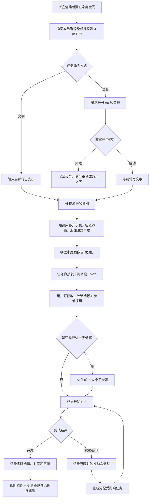
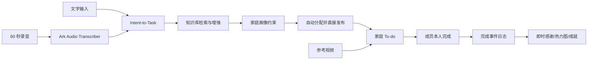

# 新生儿家庭协作台 PRD v1.1

> 项目英文名：Family Collaboration Agent  
> 项目类型：Hackathon MVP  
> 产品形态：移动端优先的响应式 Web App  
> 团队与周期：4 人 / 40 小时  
> 文档日期：2026-07-21  
> 文档状态：待团队评审  
> 上一版本：`新生儿家庭协作台_PRD_v1.0.md`

---

## 0. 版本变更摘要

【本次更新】v1.1 对产品核心入口进行了调整：

- 取消“上传护理视频后由 AI 自动提取任务”的主流程。
- 文字和 60 秒内语音成为创建家庭任务的统一入口。
- 视频改为某个任务的可选操作说明附件，不主动生成任务。
- 基础育婴知识库只负责补充步骤、检查遗漏和追加非阻断式安全提示，不主动创建任务。
- AI 生成的任务直接发布并自动分配；用户可以在发布后修改、改派或删除。
- 增加家庭成员独立身份、4 位 PIN、成员本人完成任务和贡献记录。
- 增加 AI 任务分解、贡献热力图、即时感谢、个人成就和家庭共同奖励。
- 不展示任务风险等级，不设置发布前确认；涉及诊断、药物剂量或紧急症状时，AI 不扩写医疗指令，只追加咨询专业医护人员的提示。

v1.0 保留为历史版本，不再作为当前实现基线。

---

## 1. 产品概述

### 1.1 一句话定位

【本次更新】新生儿家庭协作台面向 0–6 个月新生儿的多成员照护家庭，将家庭成员通过文字或语音表达的照护安排，自动转化为明确分工、可执行、可追踪的家庭任务。

产品完成的核心转化是：

> Family Intent → Knowledge-enhanced Task → Assignment → Execution → Positive Feedback

### 1.2 用户问题

目标家庭的问题不仅是缺少护理知识，还包括：

- 家庭成员通过微信、口头或临时提醒分派任务，容易遗漏。
- 一句话安排通常缺少负责人、时间、步骤和完成标准。
- 任务类型高度非标准，通用 To-do 无法理解育婴场景和家庭约束。
- 父亲或其他家庭成员可能因为忘记、任务不清楚和缺少即时反馈而没有按计划执行。
- 妈妈承担提醒、解释、协调、补位和检查等隐形劳动。
- 家庭成员的真实贡献不可见，正向行为难以形成持续反馈。

### 1.3 产品目标

【本次更新】MVP 必须证明：家庭成员随口说出或输入一项安排后，AI 能自动生成、增强、分配并发布任务，成员可以立即执行，家庭可以看到真实完成情况和贡献反馈。

Hackathon 展示目标：

1. 用户通过文字在 30 秒内创建并发布一个家庭任务。
2. 用户通过 60 秒内语音完成“录音—转写—生成任务—自动分配”。
3. 知识库能为任务补充操作步骤、遗漏项和注意事项，但不主动创建任务。
4. 用户可以为任务添加参考视频，成员在任务详情中查看“怎么完成”。
5. 每位家庭成员通过自己的身份进入并亲自完成任务。
6. 用户可以在 To-do 中让 AI 将父任务分解为 2–6 个子步骤。
7. 任务完成后立即产生感谢反馈，并更新成员贡献热力图。

### 1.4 成功指标

| 指标 | MVP 目标 | 测量方式 |
|---|---:|---|
| 文字创建任务成功率 | ≥ 95% | 合法文字输入成功发布任务次数 / 尝试次数 |
| 语音创建任务成功率 | ≥ 85% | 合法录音成功转写并发布任务次数 / 尝试次数 |
| 文字任务发布时长 | ≤ 8 秒 | 提交文字至任务出现在 To-do |
| 语音任务发布时长 | ≤ 20 秒 | 停止录音至任务出现在 To-do |
| 自动分配字段完整率 | 100% | 每个任务包含负责人、时间建议、步骤和分配理由 |
| AI 分解有效率 | ≥ 90% | 生成 2–6 个非重复、可执行子步骤的任务比例 |
| 独立成员完成记录准确率 | 100% | 完成事件均记录实际登录成员与时间 |
| 演示期任务完成率提升 | 可观测 | 开启即时反馈后完成率与演示基线对比 |
| 非阻断式医疗提示覆盖率 | 100% | 诊断、药物剂量、紧急症状关键词测试 |

### 1.5 产品价值

- **任务价值**：把自然语言安排直接变成明确、可执行的家庭任务。
- **知识价值**：让育婴知识在创建任务时发挥作用，而不是变成需要额外阅读的资料库。
- **协作价值**：降低提醒、追问和重复解释的成本。
- **行为价值**：通过即时感谢、贡献可视化和共同目标提高任务完成率。
- **比赛价值**：展示语音理解、知识增强、任务结构化、约束分配和行为反馈组成的 Agent 闭环。

### 1.6 非目标与边界

【本次更新】MVP 不做：

- 从视频中自动提取或创建任务。
- 由基础知识库主动安排家庭日程。
- 疾病诊断、处方、药物剂量生成或紧急医疗决策。
- 家庭成员排名、倒数榜、公开扣分或羞辱式提醒。
- 可兑换商品的积分商城。
- 实时流式语音字幕；只支持最长 60 秒的录音后转写。
- 手机号注册、实名认证和复杂账户体系。
- 家庭聊天、社区、完整日历和原生 App。
- 多个对外可见的 Agent。

---

## 2. 目标用户与使用场景

### 2.1 核心用户画像

#### 画像 A：家庭创建者/主要协调者

- 通常是新手妈妈，也可能是爸爸。
- 负责建立家庭空间、邀请成员和维护基本分工偏好。
- 经常通过口头或消息临时安排事情，希望减少重复提醒。
- 希望系统自动完成任务结构化和分配，但保留发布后修改权。

#### 画像 B：家庭执行成员

- 包括爸爸、老人或月嫂。
- 通过邀请链接选择自己的身份，并使用 4 位 PIN 进入。
- 希望快速看到“现在要做什么、怎么做、什么时候完成”。
- 完成任务后希望获得明确、具体、非幼稚化的正向反馈。

### 2.2 典型场景

#### 场景 1：一句话创建任务

妈妈输入“爸爸今晚八点前把宝宝睡前用品准备好”。AI 自动生成任务标题、负责人、时间、预计时长和步骤，调用知识库补充遗漏后直接发布。爸爸进入自己的页面即可看到任务。

#### 场景 2：语音记录临时安排

家人腾不出手打字，点击录音并说“奶奶明天早上帮忙把换洗衣物整理一下，放到护理台旁边”。录音停止后系统转写、生成任务并自动分配，用户无需进入确认页。

#### 场景 3：给任务附加操作视频

家庭创建“睡前用品准备”任务后，上传一个参考视频。执行成员在任务详情中播放视频了解具体摆放方式；视频不会产生额外任务。

#### 场景 4：AI 分解复杂 To-do

爸爸看到“准备宝宝睡前护理”任务，不清楚从哪里开始，点击“AI 分解”。系统保留父任务并生成检查室温、准备衣物、摆放用品和清理区域等子步骤。

#### 场景 5：贡献反馈促进履约

爸爸完成当天任务后，立即看到“你完成了今晚的用品准备，让睡前流程更顺畅”。个人当天贡献格被点亮，家庭周进度同步更新，但不显示成员排名。

---

## 3. 核心用户动线



异常原则：

- AI 生成失败时保留用户原始文字或转写文本，允许直接保存为简单任务。
- 语音转写失败不清空录音，允许重试或复制为文字输入。
- 知识库不可用时仍发布任务，只跳过知识增强并明确提示。
- 自动分配找不到合适成员时，任务以“待认领”状态直接发布。
- 涉及诊断、药物剂量或紧急症状时照常发布用户原始任务，但 AI 不扩写医疗操作，只追加专业就医提示。
- 所有 AI 生成内容在发布后均可由有权限成员修改。

---

## 4. 功能清单与优先级

```text
新生儿家庭协作台
├── 🔴 P0 轻量家庭身份
│   ├── 创建家庭空间与邀请链接
│   ├── 选择成员身份
│   └── 设置 4 位 PIN 与记住身份
├── 🔴 P0 统一 AI 任务入口
│   ├── 文字输入
│   ├── 最长 60 秒语音录入与转写
│   ├── AI 提取标题、时间、负责人和完成标准
│   └── 直接发布并支持事后修改
├── 🔴 P0 知识库增强
│   ├── 补充执行步骤
│   ├── 检查遗漏
│   └── 追加非阻断式安全提示
├── 🔴 P0 家庭画像与自动分配
│   ├── 成员可用时间、能力限制和偏好
│   ├── 自动分配负责人
│   └── 无合适成员时发布为待认领
├── 🔴 P0 家庭 To-do
│   ├── 父任务与 2–6 个子步骤
│   ├── AI 分解已有任务
│   ├── 完成、跳过、改派和动态调整
│   └── 参考视频附件
├── 🟡 P1 履约反馈
│   ├── 完成后的具体感谢
│   ├── 7 天个人贡献热力图
│   └── 家庭整体完成进度
├── 🟡 P1 成就系统
│   ├── 首次完成、连续履约和主动补位徽章
│   └── 家庭共同目标与纪念卡
└── ⚪ P2 赛后规划
    ├── 家庭自定义共同奖励
    ├── 通知与日历同步
    ├── 长期成长时间轴
    └── 微信小程序
```

### 4.1 40 小时强制范围

【本次更新】P0 主闭环：

> 成员身份 → 文字/语音创建 → 知识增强 → 自动分配并发布 → AI 分解 → 成员完成 → 即时感谢

如时间不足，按以下顺序降级：

1. 家庭共同奖励降为固定演示数据。
2. 贡献热力图降为最近 7 天的简单格子图，不做复杂统计。
3. 参考视频只支持上传与播放，不做封面截取和转码。
4. 动态调整只支持“成员临时不可用”。
5. 不得取消文字/语音任务入口、自动发布、成员独立身份和真实完成记录。

---

## 5. 信息架构与关键页面

### 5.1 底部导航

【本次更新】移动端底部导航调整为：

- **今日**：当前成员的任务和家庭进度。
- **创建**：文字/语音统一任务入口。
- **贡献**：个人热力图、家庭进度和成就。
- **家庭**：成员画像、邀请和权限。

### 5.2 “今日”页面线框

```text
┌──────────────────────────────────┐
│ 新生儿家庭协作台       [爸爸 ▾]  │
│ 7 月 21 日 · 今天                │
├──────────────────────────────────┤
│ 早上好，今天有 2 项任务           │
│ 家庭进度 ██████░░  5/7           │
├──────────────────────────────────┤
│ 下一项                            │
│ ┌──────────────────────────────┐ │
│ │ 20:00 前 · 睡前用品准备      │ │
│ │ 预计 10 分钟 · 4 个子步骤    │ │
│ │ [查看步骤] [参考视频] [完成]  │ │
│ └──────────────────────────────┘ │
│                                  │
│ 其他任务                          │
│ ○ 整理换洗衣物       奶奶        │
│ ○ 记录晚间用品库存   待认领       │
├──────────────────────────────────┤
│ [今日]   [＋创建]   [贡献] [家庭] │
└──────────────────────────────────┘

任务详情底部抽屉：
┌──────────────────────────────────┐
│ 睡前用品准备                 [×] │
│ □ 检查室温                       │
│ □ 准备干净衣物                   │
│ □ 摆放护理用品                   │
│ □ 清理操作区域                   │
│                                  │
│ 知识库提醒：用品应放在伸手可及处  │
│ [播放参考视频]                    │
│ [AI 分解] [修改/改派]   [完成]    │
└──────────────────────────────────┘
```

### 5.3 “创建”页面线框

```text
┌──────────────────────────────────┐
│ 创建家庭任务                      │
├──────────────────────────────────┤
│ 说说需要家人做什么                │
│ ┌──────────────────────────────┐ │
│ │ 爸爸今晚八点前把宝宝睡前用品  │ │
│ │ 准备好……                      │ │
│ └──────────────────────────────┘ │
│                                  │
│ [🎙 开始录音]  最长 60 秒          │
│                                  │
│ 可选：添加“怎么完成”的参考视频    │
│ [＋ 添加视频]                     │
│                                  │
│              [生成并发布任务]     │
├──────────────────────────────────┤
│ [今日]   [＋创建]   [贡献] [家庭] │
└──────────────────────────────────┘
```

---

## 6. 核心功能详细需求

### 6.1 轻量家庭身份（P0）

#### 功能描述

【本次更新】家庭创建者生成邀请链接。成员首次打开后选择预先建立的成员身份并设置 4 位 PIN；浏览器记住身份，后续完成记录归属实际操作成员。

#### 交互与状态

| 场景 | 处理方式 |
|---|---|
| 创建家庭 | 生成不可预测的家庭 ID 和邀请链接 |
| 首次加入 | 展示未被占用的成员身份 |
| 设置 PIN | 必须输入两次相同的 4 位数字 |
| 返回访问 | 默认恢复上次身份，敏感操作要求 PIN |
| 切换身份 | 必须输入目标成员 PIN |
| PIN 错误 | 提示剩余尝试次数，不泄露正确身份信息 |
| 成员已被认领 | 不允许直接覆盖，由家庭创建者重置 |

#### 边界条件

- 家庭成员最少 1 人、最多 8 人。
- PIN 连续错误 5 次后锁定 10 分钟。
- MVP 不提供短信找回；家庭创建者可以重置成员 PIN。
- 完成事件必须记录 `actor_member_id`，不能只记录任务负责人。
- 同一成员可在多个设备登录；最后写入采用任务版本号校验。

#### 验收标准

1. 邀请成员可在 30 秒内选择身份并进入自己的任务页。
2. 切换身份必须校验 PIN。
3. 任务完成记录能够区分负责人和实际完成人。

---

### 6.2 文字/语音统一 AI 任务入口（P0）

#### 功能描述

【本次更新】用户输入文字或录制最长 60 秒语音。语音先通过 Ark Audio Transcriber 转写；AI 再从原始文本中提取任务标题、时间、负责人意图、完成标准和上下文，并直接发布。

#### 自动生成字段

- 任务标题。
- 原始输入文本。
- 建议负责人或待认领。
- 建议完成时间。
- 预计时长。
- 完成标准。
- 2–6 个初始子步骤（适合拆分时）。
- 分配理由。
- 知识库补充与注意事项。

#### 交互与状态

| 状态 | UI 表现 | 用户操作 |
|---|---|---|
| 空状态 | 文本框、录音按钮和示例文案 | 输入或录音 |
| 录音中 | 波形、秒数、停止按钮 | 停止、取消 |
| 转写中 | “正在把语音变成任务…” | 等待、取消 |
| 生成中 | “正在补充步骤并安排负责人…” | 等待 |
| 已发布 | Toast + 跳转到任务详情 | 修改、改派、添加视频 |
| 转写失败 | 保留录音，说明原因 | 重试、改用文字 |
| AI 失败 | 保留原文，提供简单任务降级 | 直接保存、重试 |

#### 边界条件

- 文字输入 2–500 个中文字符。
- 录音最长 60 秒，最短 1 秒；超时自动停止。
- 静音或无法识别人声时不创建空任务。
- 一段输入包含多个独立事项时，最多创建 5 个父任务。
- 时间表达不清时默认“今天”，并标记“时间由 AI 推测，可修改”。
- 未指定负责人时根据家庭画像自动分配；无合适成员时发布为待认领。
- 重复提交使用请求 ID 去重，不得创建重复任务。

#### 验收标准

1. 文字和语音最终进入相同任务 Schema。
2. 成功生成后无需确认，任务直接出现在家庭 To-do。
3. AI 失败时用户原始输入不丢失，并可降级为简单任务。

---

### 6.3 基础育婴知识库增强（P0）

#### 功能描述

【本次更新】知识库不主动创建任务。任务意图提取后，系统用标题、原文和场景检索相关知识，仅用于：

- 补充可执行子步骤。
- 检查可能遗漏的准备项。
- 追加普通注意事项。
- 对诊断、药物剂量或紧急症状添加非阻断式安全提示。

#### 处理规则

1. 家庭原始意图优先，知识库不得改变负责人和核心目标。
2. 知识库补充内容必须标记来源条目 ID。
3. 检索不到相关内容时正常发布，不生成虚构引用。
4. 知识条目冲突时不替用户裁决，展示“存在不同做法，请结合专业建议”。
5. 医疗相关任务照常发布原始文本，但 AI 不扩写诊断、剂量或处置步骤。

#### 状态与失败处理

| 状态 | 处理方式 |
|---|---|
| 命中 | 任务详情展示“知识库补充” |
| 未命中 | 不显示空模块，任务正常发布 |
| 超时 | 任务先发布，标记“知识补充暂不可用” |
| 冲突 | 展示来源与非阻断式提醒 |
| 条目失效 | 不再用于新任务，历史任务保留原引用快照 |

#### 验收标准

1. 关闭知识库后仍能创建和发布任务。
2. 知识补充不会主动新增家庭日程。
3. 每条知识补充都可追溯到知识条目。

---

### 6.4 参考视频附件（P0）

#### 功能描述

【本次更新】视频只用于说明某个任务“怎么完成”，不参与任务意图识别，不自动生成任务或子步骤。

#### 交互规则

- 创建任务时或发布后添加一个参考视频。
- 任务卡仅显示“有参考视频”图标；在详情抽屉中播放。
- 用户可以为视频填写不超过 100 字的说明。
- 删除视频需要二次确认；删除任务时一并删除视频关联。

#### 文件限制

- 格式：MP4、MOV、WebM。
- 单文件最大 100 MB。
- 建议时长不超过 5 分钟。
- MVP 每个父任务最多 1 个视频；子步骤不单独上传视频。

#### 状态与失败处理

| 状态 | UI 表现 | 用户操作 |
|---|---|---|
| 无视频 | “添加参考视频” | 上传 |
| 上传中 | 百分比进度 | 取消 |
| 可播放 | 封面/文件图标 + 时长 | 播放、替换、删除 |
| 转码中 | “视频处理中” | 稍后查看 |
| 失败 | 说明格式、大小或网络原因 | 重试、换文件 |
| 已过期 | “视频已失效” | 重新上传 |

#### 验收标准

1. 上传视频不会触发 AI 任务生成接口。
2. 成员可从任务详情播放参考视频。
3. 视频失败不影响任务本身的创建、展示和完成。

---

### 6.5 家庭画像与自动分配（P0）

#### 功能描述

保留 v1.0 的成员画像：身份、经验、可用时段、能力限制和偏好。AI 生成任务后根据明确点名、可用时间、限制、偏好和当前负载自动分配并直接发布。

#### 分配优先级

1. 用户在原始输入中明确点名的成员。
2. 成员可用时间和硬性限制。
3. 任务经验匹配。
4. 当天已分配任务量。
5. 成员偏好。

#### 直接发布规则

- 找到合适成员：以该成员为负责人发布。
- 无合适成员：以“待认领”发布，不阻断创建。
- 用户发布后可立即改派。
- 改派后的人工选择优先于之后的 AI 动态调整。

#### 验收标准

1. 所有任务均直接发布，不进入草稿确认页。
2. 分配结果包含一句可理解的理由。
3. 无法分配时不编造成员或违反限制。

---

### 6.6 AI 任务分解（P0）

#### 功能描述

【本次更新】用户在任意未完成父任务中点击“AI 分解”，系统保留父任务并生成 2–6 个可勾选子步骤。

#### 分解规则

- 子步骤按执行顺序排列。
- 每一步使用动词开头，单步不超过 50 字。
- 子步骤默认继承父任务负责人和截止时间。
- 所有必做子步骤完成后父任务自动完成。
- 贡献只按父任务计算一次，不能通过反复拆分增加贡献。
- 再次分解前提示会替换未完成的 AI 子步骤；用户手动创建的子步骤保留。

#### 状态与失败处理

| 状态 | 处理方式 |
|---|---|
| 无子步骤 | 显示“AI 分解”入口 |
| 分解中 | 按钮禁用并显示加载状态 |
| 成功 | 展开新子步骤并提示可编辑 |
| 内容过于简单 | 提示“这个任务已经足够明确” |
| AI 失败 | 保留原任务，允许重试或手动添加 |
| 并发修改 | 版本冲突时不覆盖，要求刷新后重试 |

#### 验收标准

1. 父任务不会因分解消失或变成多项独立贡献。
2. AI 子步骤可编辑、排序、删除和勾选。
3. 父任务完成状态与必做子步骤保持一致。

---

### 6.7 家庭 To-do 与真实完成记录（P0）

#### 功能描述

每位成员进入自己的“今日”页查看个人任务和家庭任务。任务状态包括待开始、进行中、已完成、已跳过、受影响和已取消。

#### 完成记录

- `assignee_member_id`：计划负责人。
- `actor_member_id`：实际点击完成的成员。
- `completed_at`：完成时间。
- `completion_source`：本人完成、代完成、自动完成。
- 代他人完成时必须选择原因，热力图计入实际完成人并保留补位标记。

#### 交互规则

- 完成后提供 5 秒撤销。
- 跳过时选择原因：无需执行、条件不满足、时间来不及、其他。
- 已完成任务不被动态调整覆盖。
- 任务修改或改派记录进入活动日志。

#### 验收标准

1. 每条完成事件都能追溯到实际成员身份。
2. 页面刷新和多设备访问后任务状态一致。
3. 同一任务重复点击完成只记录一次。

---

### 6.8 贡献热力图与即时感谢（P1）

#### 功能描述

【本次更新】以提高任务完成率为首要目标，用即时、具体、非比较性的反馈强化履约；其次让家庭成员贡献被看见。

#### 贡献计算

- 每日完成率 = 当天本人实际完成的到期父任务数 / 当天本人负责的到期父任务数。
- 被取消任务不进入分母。
- 代他人完成计入实际完成人的“补位贡献”，但不改变原负责人的按时完成率。
- 子步骤不单独计分。
- 热力图显示最近 7 天四档完成度：无任务、部分完成、基本完成、全部完成。

#### 展示原则

- 默认只展示当前成员自己的热力图和家庭整体完成度。
- 不展示倒数排名、红色警告、个人扣分或“最差成员”。
- 家庭成员详情可以展示其贡献摘要，但使用事实描述，不做道德评价。
- 热力图必须同时有文字或图标，不只依赖颜色。

#### 即时感谢文案

反馈必须包含任务和影响，例如：

> 你完成了今晚的用品准备，让睡前流程更顺畅。

禁止使用空泛或幼稚化表达，例如“真棒！你得了 10 分”。

#### 验收标准

1. 完成任务后 300 毫秒内出现即时反馈。
2. 撤销完成后同步撤销贡献记录。
3. 热力图数据与任务事件日志一致。

---

### 6.9 成就与家庭共同奖励（P1/P2）

#### 功能描述

【本次更新】成就用于强化持续履约，不把育儿责任商品化。

#### P1 个人成就

- **第一次接力**：首次完成家庭任务。
- **稳定协作者**：连续 3 天完成全部到期任务。
- **准时守护**：一周内按时完成率达到 80%。
- **主动补位**：实际完成 3 项他人无法完成的任务。

成就只授予一次，可在个人贡献页查看，不向家庭成员发送比较通知。

#### P1 家庭成就

- **一起完成的一周**：家庭连续 7 天整体完成率达到 80%。
- 达成后生成一张可保存的家庭纪念卡，展示完成的任务类型和感谢语，不展示成员排名。

#### P2 家庭自定义奖励

家庭可设置一个共同愿望，例如共同用餐、周末休息安排或为主要照护者留出个人时间。系统在家庭目标达成后提醒兑现，不提供商品商城或平台积分兑换。

#### 验收标准

1. 相同事件不能重复解锁同一成就。
2. 撤销完成导致条件不满足时，相应未展示成就不发放。
3. 奖励不与医疗、婴儿安全或必要照护任务的执行资格绑定。

---

### 6.10 动态调整（P0）

保留 v1.0 的局部调整能力。成员不可用、任务延误或跳过后，Agent 只修改受影响的未完成任务；已完成、用户锁定和未受影响任务保持不变。

【本次更新】调整建议直接应用于低风险普通任务，不再进入方案确认页；每次调整后显示可撤销 Toast，用户可在活动日志中恢复上一版本。涉及用户人工改派的任务不被自动覆盖。

---

## 7. 核心数据规范

### 7.1 家庭成员身份

| 字段名 | 类型 | 限制 | 必填 | 说明 |
|---|---|---:|---|---|
| member_id | UUID/String | 36 | 是 | 家庭内唯一 |
| display_name | String | 1–20 | 是 | 成员称呼 |
| role | String | 1–20 | 是 | 爸爸、妈妈、老人等 |
| pin_hash | String | — | 是 | 只存哈希，不存明文 PIN |
| identity_claimed | Boolean | — | 是 | 是否已认领 |
| available_slots | Enum[] | 最多 4 项 | 否 | 早晨、白天、傍晚、夜间 |
| limitations | String[] | 最多 10 项 | 否 | 能力或时间限制 |
| preference | Enum | 3 种 | 否 | lead/assist/simple |

### 7.2 家庭任务

| 字段名 | 类型 | 限制 | 必填 | 说明 |
|---|---|---:|---|---|
| task_id | UUID/String | 36 | 是 | 父任务唯一 ID |
| title | String | 1–50 | 是 | AI 生成，可修改 |
| raw_input | String | 2–500 | 是 | 原始文字或语音转写 |
| input_type | Enum | text/voice | 是 | 任务入口 |
| assignee_member_id | String/Null | 36 | 否 | 负责人；空值表示待认领 |
| due_at | ISO DateTime/Null | — | 否 | 建议完成时间 |
| duration_min | Integer | 1–120 | 是 | 预计时长 |
| completion_criteria | String | 1–300 | 是 | 完成标准 |
| assignment_reason | String | 1–150 | 是 | 分配理由 |
| status | Enum | 6 种 | 是 | pending/in_progress/completed/skipped/affected/cancelled |
| knowledge_notes | Object[] | 最多 10 项 | 否 | 知识补充与来源快照 |
| safety_notice | String/Null | ≤300 | 否 | 非阻断式安全提示 |
| version | Integer | ≥1 | 是 | 并发更新控制 |

### 7.3 子步骤

| 字段名 | 类型 | 限制 | 必填 | 说明 |
|---|---|---:|---|---|
| subtask_id | UUID/String | 36 | 是 | 子步骤唯一 ID |
| parent_task_id | UUID/String | 36 | 是 | 父任务 ID |
| title | String | 1–50 | 是 | 动词开头 |
| order | Integer | 1–6 | 是 | 执行顺序 |
| required | Boolean | — | 是 | 是否影响父任务完成 |
| source | Enum | ai/user/knowledge | 是 | 生成来源 |
| completed | Boolean | — | 是 | 完成状态 |

### 7.4 参考视频

| 字段名 | 类型 | 限制 | 必填 | 说明 |
|---|---|---:|---|---|
| attachment_id | UUID/String | 36 | 是 | 附件唯一 ID |
| task_id | UUID/String | 36 | 是 | 只关联父任务 |
| file_name | String | 1–255 | 是 | 安全清洗后的文件名 |
| mime_type | Enum | mp4/mov/webm | 是 | 与文件头一致 |
| file_size | Integer | ≤100 MB | 是 | 正整数 |
| note | String | ≤100 | 否 | 用户说明 |
| status | Enum | 5 种 | 是 | uploading/processing/ready/failed/expired |
| expires_at | ISO DateTime | — | 是 | 原视频删除时间 |

### 7.5 完成事件与贡献

| 字段名 | 类型 | 必填 | 说明 |
|---|---|---|---|
| event_id | UUID/String | 是 | 事件唯一 ID |
| task_id | UUID/String | 是 | 父任务 ID |
| assignee_member_id | UUID/String/Null | 否 | 计划负责人 |
| actor_member_id | UUID/String | 是 | 实际完成人 |
| event_type | Enum | 是 | completed/undo/skipped/reassigned |
| completion_source | Enum | 否 | self/substitute/automatic |
| occurred_at | ISO DateTime | 是 | 事件时间 |
| task_version | Integer | 是 | 事件发生时任务版本 |

### 7.6 成就

| 字段名 | 类型 | 必填 | 说明 |
|---|---|---|---|
| achievement_id | String | 是 | 稳定成就编码 |
| scope | Enum | 是 | member/family |
| owner_id | String | 是 | 成员或家庭 ID |
| unlocked_at | ISO DateTime | 是 | 解锁时间 |
| source_event_ids | String[] | 是 | 支撑成就的事件集合 |

---

## 8. Family Collaboration Agent 架构

### 8.1 单 Agent 原则

对用户只呈现一个 Family Collaboration Agent。内部能力更新为：

1. **Intent-to-Task Skill【本次更新】**：把文字或转写文本转换为任务。
2. **Knowledge Enrichment Skill【本次更新】**：检索知识库并补充步骤、遗漏和注意事项。
3. **Family Profile Skill**：读取家庭成员约束。
4. **Task Assignment Skill**：自动分配并直接发布。
5. **Task Decomposition Skill【本次更新】**：生成父任务下的 2–6 个子步骤。
6. **Adaptive Adjustment Skill**：动态调整受影响任务。
7. **Contribution Feedback Skill【本次更新】**：根据真实完成事件生成即时感谢、热力图和成就。

视频上传是普通任务附件能力，不属于 Agent Skill。

### 8.2 数据流



### 8.3 模型输出约束

- 文字与语音必须进入同一 Task JSON Schema。
- 模型输出通过 Zod/JSON Schema 校验后才写入任务数据库。
- 首次校验失败自动修复一次；仍失败时降级保存原始输入为简单任务。
- 知识库和 Agent 失败不得丢失用户输入。
- 不向模型发送 PIN 明文。

---

## 9. 文案规范

### 9.1 整体风格

采用“亲切、具体、克制、成人化”的语气：

- 感谢具体行为和影响，不使用幼稚化积分语言。
- 不指责未完成成员，不使用“拖后腿”“倒数”等表达。
- 不制造育儿焦虑，不把 AI 表述为医生。
- 错误信息说明原因和可恢复动作。

### 9.2 界面文案示例

| 场景 | 文案 |
|---|---|
| 创建页标题 | 说说需要家人做什么 |
| 语音按钮 | 开始录音 |
| 录音中 | 正在录音，最长 60 秒 |
| 转写中 | 正在把语音变成任务… |
| 生成中 | 正在补充步骤并安排负责人… |
| 发布成功 | 任务已发布，你可以继续修改 |
| AI 降级 | 暂时无法智能整理，已保留原文，可直接保存为简单任务 |
| 知识库超时 | 任务已发布，知识补充暂不可用 |
| 待认领 | 暂时没有合适负责人，任务已发布为待认领 |
| AI 分解 | 把任务拆成步骤 |
| 即时感谢 | 你完成了今晚的用品准备，让睡前流程更顺畅 |
| 医疗提示 | 这项安排可能涉及医疗判断，AI 未补充操作建议；请咨询专业医护人员 |
| 视频说明 | 添加“怎么完成”的参考视频 |

---

## 10. 安全与隐私边界

### 10.1 非阻断式安全规则

【本次更新】产品不展示任务风险等级，也不设置发布前确认。所有用户输入直接生成并发布，但：

- 对诊断、药物剂量、停药建议和紧急症状，AI 不扩写医疗步骤。
- 任务保留用户原始输入，并追加咨询专业医护人员的提示。
- 知识库不得生成处方、剂量或替代紧急就医的建议。
- 安全提示不影响任务发布、修改和删除。

### 10.2 隐私

- 全链路 HTTPS。
- PIN 只保存带盐哈希。
- 录音与参考视频上传前明确说明用途。
- 原始录音在转写成功后 24 小时内删除。
- 参考视频默认 24 小时后删除原文件；任务保留“附件已过期”状态。
- 不要求真实姓名、手机号、身份证或宝宝医疗信息。
- 日志不得记录 API Key、PIN 明文或完整录音内容。

---

## 11. 非功能性需求

### 11.1 性能

- 移动网络首页首屏 ≤ 2.5 秒。
- 文字任务从提交到发布目标 ≤ 8 秒。
- 60 秒内语音从停止录音到发布目标 ≤ 20 秒。
- 普通任务状态更新反馈 ≤ 300 毫秒。
- 贡献热力图查询 ≤ 1 秒。

### 11.2 权限

- 家庭创建者：邀请、重置 PIN、编辑成员、删除家庭空间。
- 普通成员：查看家庭任务、完成本人任务、认领待认领任务、创建任务、修改自己创建的任务。
- 改派他人任务和删除他人创建的任务需要创建者权限。

### 11.3 并发与一致性

- 任务使用版本号做乐观锁。
- 完成事件使用幂等键，重复请求只写入一次。
- 热力图和成就从事件日志派生，不直接累加不可追溯的积分。
- 多设备冲突时保留最新合法版本并提示刷新。

### 11.4 兼容性与可访问性

- 支持最新版 Chrome、Edge、Safari 移动浏览器。
- 适配 375–430 px 手机宽度并兼容桌面演示。
- 录音权限被拒绝时提供文字入口和浏览器设置指引。
- 点击区域 ≥44×44 px；状态同时使用文字/图标，不只依赖颜色。

---

## 12. 测试与验收

### 12.1 必测主流程

1. 家庭创建者生成邀请链接，爸爸选择身份并设置 PIN。
2. 输入一句文字，验证任务被增强、自动分配并直接发布。
3. 录制 10–30 秒语音，验证转写后进入同一任务 Schema。
4. 为已发布任务添加参考视频，验证不会创建新任务。
5. 点击 AI 分解，验证父任务保留且生成 2–6 个子步骤。
6. 爸爸以本人身份完成任务，验证记录实际成员、即时感谢和热力图更新。
7. 撤销完成，验证任务、热力图和未展示成就同步回退。

### 12.2 必测异常流程

- 录音权限被拒绝、录音静音、超过 60 秒和转写超时。
- AI 输出非法 JSON、一次输入包含超过 5 个事项。
- 知识库未命中、超时和返回冲突条目。
- 无合适成员可分配，验证任务发布为待认领。
- 上传不支持格式、超过 100 MB 和播放失败的视频。
- PIN 连续错误 5 次、成员身份已被认领和创建者重置 PIN。
- 多设备同时完成同一任务。
- 涉及“退烧药剂量”“呼吸异常”等输入，验证直接发布但 AI 不扩写医疗步骤。

### 12.3 演示脚本

1. 打开移动端 Web App，爸爸通过邀请链接选择身份。
2. 妈妈输入“爸爸今晚八点前准备好宝宝睡前用品”。
3. 展示 AI 补充步骤、知识库提醒和自动分配后直接发布。
4. 为任务添加一个“怎么摆放用品”的参考视频。
5. 爸爸在自己的“今日”页打开任务并播放视频。
6. 点击“AI 分解”，展示父任务下的子步骤。
7. 爸爸完成任务，展示具体感谢和贡献热力图点亮。
8. 展示家庭整体完成进度和“第一次接力”成就。

---

## 13. 40 小时开发建议

| 阶段 | 时间 | 必须产出 |
|---|---:|---|
| 接口与 Schema 验证 | 0–4h | 文字任务 Schema、音频转写、任务生成冒烟测试 |
| 身份与家庭画像 | 4–10h | 邀请链接、成员选择、PIN、家庭成员数据 |
| 统一任务入口 | 8–18h | 文字/语音输入、知识增强、直接发布、降级保存 |
| To-do 与分配 | 16–26h | 自动分配、任务列表、完成事件、待认领 |
| 视频与 AI 分解 | 24–31h | 参考视频上传/播放、父子任务 |
| 履约反馈 | 30–35h | 即时感谢、7 天热力图、首个成就 |
| 联调与演示 | 35–40h | 真机、并发、安全提示、部署与演示脚本 |

团队建议分工：

- 1 人：Figma、创建页/今日页/贡献页与文案。
- 1 人：前端状态、身份、录音、To-do 和热力图。
- 1 人：服务端、任务存储、视频附件、PIN 与事件日志。
- 1 人：Ark 转写、任务 Prompt、知识检索、分配/分解与联调。

---

## 14. 风险与降级

| 风险 | 影响 | 预防 | 降级方案 |
|---|---|---|---|
| 直接发布产生误任务 | 用户需要返工 | 保留原文、可撤销、发布后可编辑 | AI 失败时保存简单任务 |
| 语音转写不准确 | 任务语义错误 | 保留转写文本与原录音短期回放 | 改用文字输入 |
| 知识库补充不可靠 | 错误步骤被采用 | 来源追溯、冲突提示、不扩写医疗指令 | 跳过知识增强直接发布 |
| 轻量身份被代用 | 贡献失真 | PIN、切换身份验证、事件日志 | 演示中使用固定成员设备 |
| 热力图引发比较 | 家庭冲突 | 不排名、不扣分、默认看本人和家庭整体 | 只保留即时感谢 |
| 功能范围超出 40 小时 | 主闭环不完整 | 锁定 P0、每 4 小时集成 | 共同奖励使用固定演示数据 |
| 参考视频上传失败 | 操作说明缺失 | 文件限制、进度和重试 | 任务仍可正常执行 |

---

## 15. 对现有文档与代码的影响

【本次更新】以下内容需要后续实施计划同步调整：

- v1.0 的 `Video Understanding Skill` 和“视频生成任务”主链路不再适用。
- 原实施计划 Task 3–5 中的视频理解与内容确认页需要改为语音任务入口和参考视频附件。
- 仓库现有 `app/audio transcript` 可以复用为语音创建任务的转写能力。
- 仓库现有视频分析代码不属于 v1.1 的主流程，应在实施计划评审后决定保留为实验工具还是移出产品路径。
- 原“方案确认页”取消；AI 任务直接发布，改为发布后的详情编辑和撤销。
- 数据层新增成员 PIN、原始输入、输入类型、子步骤、完成事件、贡献和成就。
- 底部导航从“今日/方案/家庭”调整为“今日/创建/贡献/家庭”。

---

## 16. 待团队确认

- [ ] 基础育婴知识库的首批来源、版权和审核负责人。
- [ ] 远程部署使用的数据库与对象存储。
- [ ] 参考视频与录音的实际保留时间是否统一为 24 小时。
- [ ] 家庭创建者重置 PIN 的恢复凭证。
- [ ] P1 首发只实现哪些个人成就。
- [ ] 现有视频分析代码保留、归档或改造成附件处理工具。

---

## 17. 参考资料

- 火山方舟产品与 Responses API：https://docs.volcengine.com/docs/82379/1795150?lang=zh
- 仓库现有音频转写工具：`app/audio transcript/README.md`

